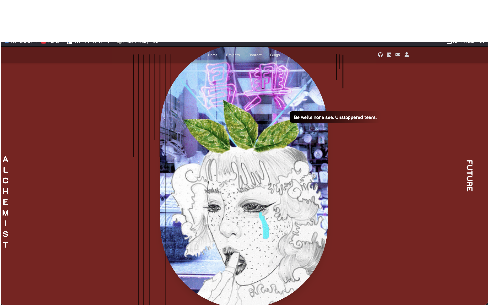
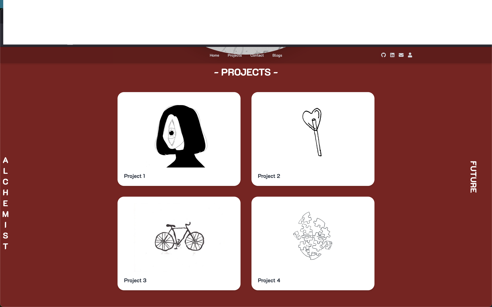
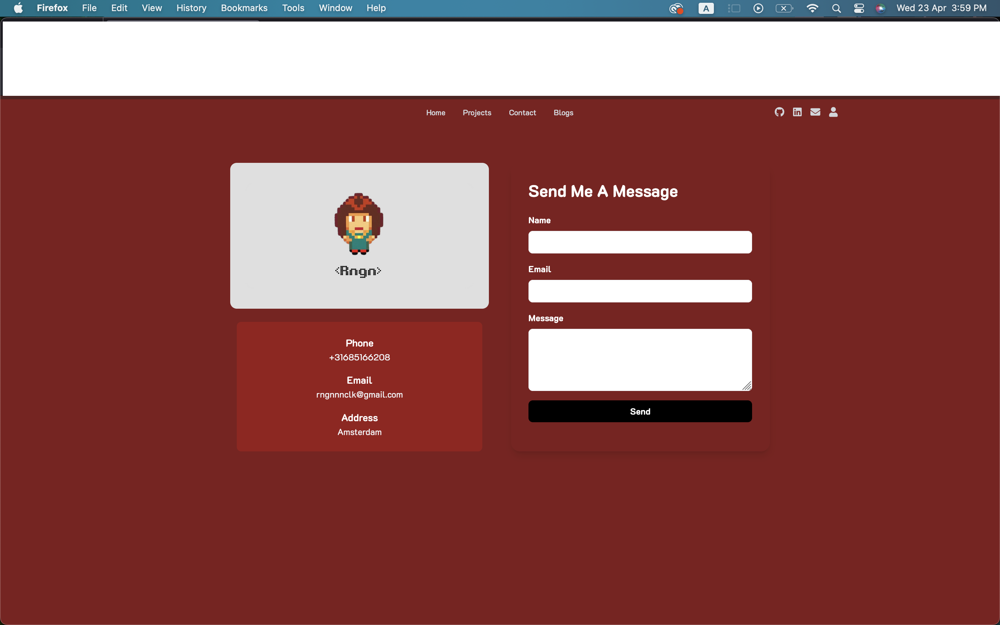

# 🧪 Alchemist — A Poetic Web Experience by Rengin Forbes

> _“We are the time. We are the famous.”_  
> A digital poem. A scroll. A sensation.

---

## 🎭 About

**Alchemist** is not a portfolio.  
It’s a poetic, visual, interactive experience designed to express emotion, metaphor, and mood through the lens of code.

This site is a blend of aesthetic experimentation and deep feeling —  
where minimalism meets meaning, and motion meets silence.

---

## 📸 Screenshots

| SS | SS1 | SS2 |
|:--:|:---:|:---:|
|  |  |  |

## 🌐 Live Demo

👉 [alchemist.vercel.app](https://alchemist-kappa.vercel.app/)

---

## ✨ Features

- 📱 Fully responsive & mobile-first layout
- 🌗 Dark theme with blurred glass effects
- 🧭 Custom hamburger menu with animated blur overlay
- 🎞 Scroll-based image animation and text transitions
- 🧩 Individual poetic project pages
- 📬 Contact form with elegant design

---

## 🛠 Tech Stack

- **Next.js**
- **React**
- **Tailwind CSS**
- **Framer Motion**
- **Font Awesome**
- **Deployed on Vercel**

---

## 📁 Project Structure

Alchemist/
├── public/               # Static files
│   └── assets/
│       └── techs/        # Images & GIFs
│           ├── eye.jpg
│           ├── lolipop.jpg
│           ├── tears.gif
│           ├── puzzle.jpg
├── pages/                # Next.js pages
│   ├── index.jsx         # Home
│   ├── projects.jsx      # Projects overview
│   ├── contact.jsx       # Contact form
│   ├── project1.jsx      # Project pages (1–4)
│   └── ...
├── components/           # Reusable UI
│   ├── Header.js
│   ├── Navbar.jsx
├── styles/
│   └── globals.css
├── lib/
│   └── swr.js            # Data fetching config
├── README.md
├── package.json
└── next.config.js

---

## 🖋 Author

Crafted with obsession by  
**Rengin Forbes**  
📧 [rngnnnclk@gmail.com](mailto:rngnnnclk@gmail.com)

---

## 🎥 Video Walkthrough

------

## 🪶 License

This project is open for inspiration.  
Feel free to fork, remix, or reference with credit.

---

## 🫧 Note

This site is not meant to be browsed — it's meant to be felt.
